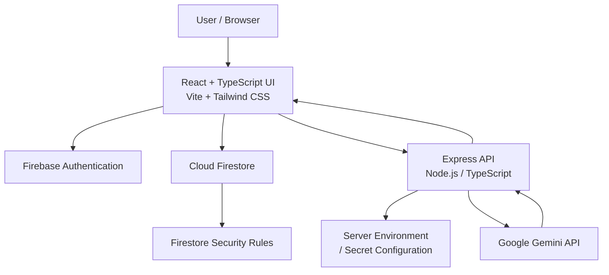

# ReflectAI — AI-Powered Secure Personal Journal & Reflection Companion

> A private, cloud-backed journaling workspace combining reflective writing, Gemini-powered AI assistance, mood insights, creative scrapbooking, and personal memory exploration.

ReflectAI transforms traditional journaling into an interactive personal workspace where users can write reflections, interact with an empathetic AI companion, analyze moods and journaling patterns, create visual scrapbook pages, explore relationships across memories, and export their personal data.

---

## ✨ 1. Project Overview

ReflectAI is a full-stack AI-powered journaling platform designed around **privacy, personalization, reflection, and user ownership**.

The application combines:

* AI-powered reflective conversations
* Personal journal management
* Mood and streak analytics
* Voice-based journaling
* AI writing assistance
* Visual scrapbook creation
* AI-generated scrapbook layouts
* Personal Life Graph exploration
* Privacy controls
* Markdown and JSON data export
* Firebase authentication and user-scoped storage
* Google Cloud Run deployment

The system uses **React + TypeScript** for the frontend, **Express + Node.js** for backend API operations, **Firebase** for authentication and persistence, and **Google Gemini** for AI functionality.

---

## 🏗️ 2. Architecture Overview

ReflectAI follows a layered cloud architecture separating the presentation layer, authentication, application API, AI processing, and persistent storage.



### Architecture Layers

| Layer          | Technology               | Responsibility                                |
| -------------- | ------------------------ | --------------------------------------------- |
| Presentation   | React 19 + TypeScript    | UI, navigation, interactions                  |
| Styling        | Tailwind CSS             | Responsive visual design                      |
| Build          | Vite                     | Development and frontend bundling             |
| Backend        | Node.js + Express        | API operations and AI integration             |
| AI             | Google Gemini API        | Reflection, analysis, coaching and generation |
| Authentication | Firebase Authentication  | User identity and authentication              |
| Database       | Cloud Firestore          | Persistent user data                          |
| Authorization  | Firestore Security Rules | User-level data isolation                     |
| Deployment     | Google Cloud Run         | Containerized application hosting             |
| Icons          | Lucide React             | UI icons                                      |
| Animation      | Motion                   | UI transitions and animations                 |
| Markdown       | React Markdown           | AI response rendering                         |

---

## 🔒 3. Security & Threat Model Overview

ReflectAI implements a layered defense model around authentication, authorization, secret protection, and user-scoped data access.

The security boundary can be represented as:

```text
                    INTERNET
                        │
                        ▼
               ┌─────────────────┐
               │   React Client  │
               └────────┬────────┘
                        │
                 Authentication
                        │
                        ▼
               ┌─────────────────┐
               │ Firebase Auth   │
               └────────┬────────┘
                        │
                     User UID
                        │
             ┌──────────┴──────────┐
             │                     │
             ▼                     ▼
      Cloud Firestore         Express API
             │                     │
      Security Rules               │
             │                     ▼
             ▼               Gemini API
        User Data
```

### Primary Security Boundaries

1. **Authentication Boundary**

   * Firebase Authentication establishes the user's identity.
   * Protected application functionality is associated with an authenticated Firebase UID.

2. **Database Authorization Boundary**

   * Firestore Security Rules restrict access based on the authenticated UID.
   * Users should only be able to access their own journal-related documents.

3. **Backend Boundary**

   * Gemini API operations are performed through the server.
   * Sensitive AI credentials are not intended to be exposed to the React client.

4. **Secret Boundary**

   * Gemini credentials are supplied through environment variables or deployment secrets.

5. **Data Ownership Boundary**

   * User data is logically isolated using Firebase UID-based ownership.

---

## 🔐 4. Authentication & Authorization

Firebase Authentication provides the identity layer for ReflectAI.

```text
User
 │
 ▼
Firebase Authentication
 │
 ▼
Authenticated Firebase UID
 │
 ├──────────────► Application
 │
 └──────────────► Firestore Authorization
```

### Authentication Responsibilities

Firebase Authentication handles:

* User sign-in
* User identity
* Session management
* Google sign-in support
* Firebase UID generation

The Firebase UID acts as the primary ownership identifier for user-specific application data.

---

## 🛡️ 5. Firestore Data Security

ReflectAI uses Firestore Security Rules to enforce user-level authorization.

The core ownership principle is:

```text
request.auth.uid == userId
```

Conceptually:

```text
Authenticated User
        │
        ▼
 Firebase UID
        │
        ▼
User-Owned Firestore Data
        │
        ├── Journal Entries
        ├── Mood Data
        ├── Conversations
        ├── Scrapbook Data
        ├── Life Graph Data
        └── Preferences
```

This prevents authenticated users from accessing data belonging to another user when the corresponding Firestore rules are correctly configured.

---

## 🔑 6. Secret & API Key Management

Gemini API credentials are handled by the backend rather than being intentionally embedded into frontend source code.

```text
React Client
     │
     │ AI Request
     ▼
Express Server
     │
     │ Server Environment
     │
     ▼
Gemini API
```

Example environment configuration:

```env
GEMINI_API_KEY=your_gemini_api_key
```

The actual API key should:

* Never be committed to Git
* Never be hardcoded in React components
* Never be exposed through frontend environment variables
* Be supplied through secure deployment configuration

For production deployments, Google Cloud secret/environment management should be preferred.

---

## 🤖 7. Gemini AI Architecture

Gemini provides the intelligence layer for ReflectAI.

AI functionality includes:

* Reflective conversations
* Journal summarization
* Emotional theme analysis
* Pattern identification
* Coaching
* Brainstorming
* Writing refinement
* AI scrapbook generation
* Contextual memory analysis

The backend constructs AI requests based on the selected feature or reflection mode.

---

## 🧘 8. AI Reflection Modes

### Mindful Reflection

Provides a supportive reflection based on the user's journal content and encourages deeper self-reflection.

### Executive Summary

Produces structured information such as:

* Key events
* Emotional themes
* Patterns
* Important takeaways
* Contextual observations

### Brainstorm Solutions

Helps users explore:

* Alternative perspectives
* Possible approaches
* Constructive solutions
* Different ways of viewing a situation

### Coaching

Uses reflective and Socratic-style questions to help users examine:

* Decisions
* Goals
* Thoughts
* Challenges
* Personal situations

---

## 🔄 9. Multi-Turn AI Conversation Flow

ReflectAI supports contextual conversations instead of treating each AI request as an isolated interaction.

```text
Journal Entry
     │
     ▼
Conversation History
     │
     ▼
Selected AI Mode
     │
     ▼
System Instructions
     │
     ▼
Express Backend
     │
     ▼
Gemini API
     │
     ▼
AI Response
     │
     ▼
Updated Conversation
```

This allows users to continue exploring the same journal context across multiple interactions.

---

## 🔁 10. Gemini Model Fallback

The backend supports a fallback strategy for recoverable Gemini failures.

```text
Primary Gemini Model
        │
        │ Failure
        ▼
Fallback Model
        │
        │ Failure
        ▼
Compatible Model
        │
        │ Failure
        ▼
Final Fallback
```

This improves resilience against temporary model availability or API-related failures.

---

## 🔄 11. End-to-End Data Flow

A typical AI reflection request follows this architecture:

```text
                    User
                     │
                     ▼
             React Journal Editor
                     │
                     │
        Journal text + mood + tags
        + conversation context
                     │
                     ▼
                Express API
                     │
                     │ Server-side AI request
                     ▼
              Google Gemini API
                     │
                     │ AI response
                     ▼
                Express API
                     │
                     ▼
                  React UI
                  │      │
                  │      └──── Continue conversation
                  │
                  └────────── Save journal
                                │
                                ▼
                          Cloud Firestore
```

### Data Flow Steps

1. User writes or edits a journal entry.
2. User selects an AI capability.
3. React sends the relevant request to the Express backend.
4. Express constructs the Gemini request.
5. Gemini processes the request.
6. Gemini returns the generated response.
7. Express returns the response to the React application.
8. The user can continue the conversation or save the journal state.
9. Persistent application data is stored in Firestore.

---

## 🎨 12. Scrapbook Studio

ReflectAI extends traditional journaling into a visual scrapbook workspace.

Users can customize journal pages with:

* 📄 Paper styles
* 🖼️ Photos
* ✨ Stickers
* 🎀 Washi tape
* 🎨 Color palettes
* 📐 Custom layouts
* 📝 Text elements
* 🔄 Resizable elements
* ↔️ Repositionable elements
* 💾 Saved presets

The editor is designed so that visual elements can be adjusted after the initial journal draft.

---

## ✨ 13. AI Scrapbook Generation

The AI Scrapbook feature generates visual layout suggestions based on journal context.

```text
Journal Reflection
       │
       ▼
     Gemini
       │
       ├── Theme
       ├── Mood
       ├── Visual Elements
       ├── Layout
       └── Decorative Style
       │
       ▼
AI Scrapbook Layout
       │
       ▼
User Customization
       │
       ▼
Saved Scrapbook
```

AI-generated layouts are intended as starting points that users can customize rather than fixed outputs.

---

## 🕸️ 14. Personal Life Graph

ReflectAI can organize recurring information from journal experiences into a connected personal graph.

```text
                       Memories
                          │
          ┌───────────────┼───────────────┐
          │               │               │
        People          Places           Goals
          │               │               │
          └───────────────┼───────────────┘
                          │
                        Themes
                          │
                       Projects
                          │
                          ▼
                    Personal Life Graph
```

The Life Graph can represent relationships between:

* People
* Places
* Goals
* Projects
* Themes
* Memories

This provides a higher-level view of recurring concepts across personal journal entries.

---

## 📊 15. Mood & Journaling Analytics

ReflectAI provides personal analytics designed to help users understand their journaling habits.

Features include:

* Mood distribution
* Journaling frequency
* Reflection consistency
* Current streak
* Milestones
* Achievement badges
* Historical patterns

The analytics are intended to provide personal insight rather than competitive scoring.

---

## 🎙️ 16. Voice Journaling

ReflectAI supports browser-based speech-to-text for hands-free journaling.

```text
Microphone
    │
    ▼
Browser Speech Recognition
    │
    ▼
Transcript
    │
    ▼
Journal Editor
    │
    ▼
Firestore
```

Voice journaling allows users to capture thoughts naturally without manually typing the entire entry.

---

## ✍️ 17. AI Writing Assistance

The writing assistant can improve journal text while preserving the user's original intent.

Potential operations include:

* Grammar correction
* Spelling correction
* Punctuation refinement
* Sentence improvement
* Speech refinement
* Clarity improvements

The objective is to assist the user's writing rather than replace their personal voice.

---

## 📦 18. Data Portability

ReflectAI supports personal data export.

Supported formats include:

```text
Markdown (.md)
JSON (.json)
```

This provides users with portable representations of their journal information and reduces unnecessary dependency on a single application format.

---

## 🔒 19. Privacy Controls

ReflectAI includes controls for optional AI-powered functionality.

Users can control whether optional functionality such as:

* AI analysis
* Memory extraction
* AI-powered insights

is enabled.

The application is designed around the principle that users should have meaningful control over optional AI processing.

> **Important:** Features that require Gemini processing necessarily send relevant content to the AI service. Privacy controls determine which optional application features are enabled and should not be interpreted as a guarantee that journal content is never processed externally.

---

## ☁️ 20. Google Cloud Architecture

ReflectAI uses Firebase and Google Cloud services as the primary cloud infrastructure.

```text
                     Google Cloud
                          │
             ┌────────────┴────────────┐
             │                         │
        Firebase                    Cloud Run
             │                         │
      ┌──────┴──────┐              Express API
      │             │                   │
 Firebase Auth   Firestore              │
      │             │                   ▼
      │        User Data            Gemini API
      │
      └────────────── Application Identity
```

### Cloud Services

| Service                  | Purpose                          |
| ------------------------ | -------------------------------- |
| Firebase Authentication  | User authentication and identity |
| Cloud Firestore          | Persistent application data      |
| Firestore Security Rules | User-level authorization         |
| Google Cloud Run         | Backend/application deployment   |
| Gemini API               | AI processing and generation     |

---

## ☁️ 21. Cloud Run Deployment

ReflectAI is designed to run as a containerized application on Google Cloud Run.

```text
GitHub Repository
       │
       ▼
Application Source
       │
       ▼
Container Build
       │
       ▼
Google Cloud Run
       │
       ├────────── Firebase Authentication
       │
       ├────────── Cloud Firestore
       │
       └────────── Gemini API
```

Cloud Run provides a managed environment for hosting the production application without maintaining traditional server infrastructure.

---

## 📁 22. Project Structure

```text
google-Ai-Journal/
│
├── public/
│   └── assets/
│
├── src/
│   ├── components/
│   ├── services/
│   ├── views/
│   └── ...
│
├── server.ts
├── firestore.rules
├── firebase-applet-config.json
├── firebase-blueprint.json
├── vite.config.ts
├── tsconfig.json
├── package.json
├── .env.example
└── README.md
```

### Important Files

| File              | Purpose                                |
| ----------------- | -------------------------------------- |
| `src/`            | React frontend and application logic   |
| `src/components/` | Reusable UI components                 |
| `src/services/`   | Client-side service integrations       |
| `src/views/`      | Application screens                    |
| `server.ts`       | Express backend and Gemini integration |
| `firestore.rules` | Firestore authorization rules          |
| `vite.config.ts`  | Vite configuration                     |
| `tsconfig.json`   | TypeScript configuration               |
| `.env.example`    | Environment variable template          |
| `package.json`    | Dependencies and scripts               |
| `public/assets/`  | Static assets                          |

---

## 🧩 23. Technology Stack

### Frontend

```text
React 19
TypeScript
Vite
Tailwind CSS
Motion
Lucide React
React Markdown
```

### Backend

```text
Node.js
Express
TypeScript
```

### AI

```text
Google Gemini API
@google/genai
```

### Cloud & Firebase

```text
Google Cloud Run
Cloud Firestore
Firebase Authentication
Firestore Security Rules
```

### Build Tools

```text
Vite
esbuild
TypeScript
npm
```

---

## 🚀 24. Local Development

### Prerequisites

Install/configure:

* Node.js
* npm
* Firebase project
* Cloud Firestore
* Firebase Authentication
* Gemini API key

---

### Clone Repository

```bash
git clone https://github.com/alen217/google-Ai-Journal.git
cd google-Ai-Journal
```

---

### Install Dependencies

```bash
npm install
```

---

### Configure Environment Variables

Create an environment configuration based on `.env.example`.

```env
GEMINI_API_KEY=your_gemini_api_key
```

Never commit the real API key to the repository.

---

### Configure Firebase

Configure the Firebase project with:

* Firebase Authentication
* Google Authentication provider if required
* Cloud Firestore
* Firestore Security Rules

Ensure the frontend Firebase configuration points to the intended Firebase project.

---

### Start Development Server

```bash
npm run dev
```

The application uses the Express server as the development entry point while integrating the Vite development environment.

---

## 🛠️ 25. Available Scripts

```bash
npm run dev       # Start development environment
npm run build     # Build frontend and backend
npm start         # Start production server
npm run preview   # Preview Vite production build
npm run lint      # TypeScript validation
```

---

## 📦 26. Production Build

The project produces both frontend and backend production bundles.

```text
                    Source Code
                        │
              ┌─────────┴─────────┐
              │                   │
             Vite               esbuild
              │                   │
              ▼                   ▼
       Frontend Bundle       Express Bundle
              │                   │
              ▼                   ▼
            dist/            dist/server.cjs
              │                   │
              └─────────┬─────────┘
                        │
                        ▼
                 Cloud Run Container
```

Build:

```bash
npm run build
```

Start:

```bash
npm start
```

---

## 🧪 27. Testing & Verification

The major application workflows can be verified through the following areas.

### Authentication

* User login
* User logout
* Google authentication
* Authenticated session handling

### Journaling

* Create journal entry
* Edit journal entry
* Save journal entry
* Delete journal entry
* Search and filtering
* Mood selection

### AI

* Mindful Reflection
* Executive Summary
* Brainstorming
* Coaching
* Multi-turn conversation
* Writing refinement
* Journal analysis

### Voice

* Microphone permission
* Speech recognition
* Transcript generation
* Transcript insertion

### Scrapbook

* Create scrapbook
* Add photos
* Resize elements
* Move elements
* Add stickers
* Add decorative elements
* Change paper styles
* Change colors
* Save layouts
* Generate AI scrapbook layouts

### Personal Insights

* Mood analytics
* Journaling streaks
* Milestones
* Life Graph exploration

### Data & Privacy

* Privacy controls
* AI feature toggles
* Markdown export
* JSON export
* Journal deletion
* User data management

---

## 🛡️ 28. Production Security Checklist

Before deploying ReflectAI publicly:

```text
[ ] Gemini API key is not exposed to frontend code
[ ] .env files are excluded from Git
[ ] Firestore Security Rules are enabled
[ ] Firestore rules require authentication
[ ] User documents are scoped to Firebase UID
[ ] Cloud Run secrets/environment variables are configured securely
[ ] Authentication providers are correctly configured
[ ] Protected API endpoints validate requests
[ ] AI output is treated as untrusted content
[ ] Rate limiting is considered
[ ] Abuse protection is considered
[ ] Logs do not unnecessarily expose journal content
[ ] Data deletion workflows are verified
[ ] Backup/recovery strategy is considered
```

---

## 🧠 29. Responsible AI Design

ReflectAI is designed to position AI as a **reflection companion**, not as an authority over the user's personal life.

The AI experience should prioritize:

* Respectful responses
* Empathetic communication
* Non-judgmental interaction
* Constructive suggestions
* User autonomy
* Context-aware responses
* Avoiding mockery or shaming
* Avoiding unnecessarily definitive conclusions

AI-generated observations should be treated as suggestions and reflections rather than objective judgments about the user.

---

## 🎯 30. Design Principles

### Privacy First

Personal journal content is treated as sensitive application data and protected through authentication, authorization, secure credentials, and controlled AI processing.

### User Ownership

Users should be able to access, manage, export, and delete their personal journal information.

### AI as a Companion

AI is intended to support reflection rather than replace personal judgment.

### Human-Centered Design

The user's writing and personal experiences remain at the center of the application.

### Creative Expression

Journaling is not limited to plain text. Visual layouts, images, colors, stickers, and scrapbook elements allow users to express memories creatively.

---

## 🔮 31. Future Improvements

Potential production improvements include:

* Automated unit tests
* Integration and end-to-end testing
* API rate limiting
* Abuse prevention
* Centralized monitoring
* Security scanning in CI/CD
* More granular backend authorization
* AI usage monitoring
* AI observability
* Automated backups
* Disaster recovery
* Improved audit logging
* Stronger API validation
* Configurable AI data-retention policies
* Expanded accessibility support

---

## 📄 32. License

No open-source license has currently been specified for this project.

If the repository is intended for public reuse, add an appropriate license such as MIT, Apache-2.0, or another license matching the project's requirements.

---

## 🌟 33. Project Summary

ReflectAI brings together journaling, generative AI, personal analytics, and creative expression into a single authenticated workspace.

```text
                         ReflectAI
                            │
        ┌───────────────────┼───────────────────┐
        │                   │                   │
        ▼                   ▼                   ▼
    Journaling         AI Companion       Personal Insights
        │                   │                   │
        ├── Voice           ├── Reflection      ├── Mood
        ├── Rich Editor     ├── Coaching        ├── Streaks
        └── Scrapbook       ├── Analysis        └── Life Graph
                            └── Writing AI
        │                   │                   │
        └───────────────────┼───────────────────┘
                            │
                            ▼
                    Firebase + Google Cloud
                            │
                 ┌──────────┴──────────┐
                 │                     │
             Firestore             Cloud Run
                 │                     │
                 └──────────┬──────────┘
                            │
                       Gemini API
```

ReflectAI explores how generative AI can make personal journaling more **reflective, organized, creative, and useful** while keeping **authentication, user-scoped data access, privacy controls, responsible AI behavior, and user ownership** at the center of the platform.

---

### Built With

**React · TypeScript · Vite · Tailwind CSS · Express · Firebase · Cloud Firestore · Google Cloud Run · Google Gemini**
